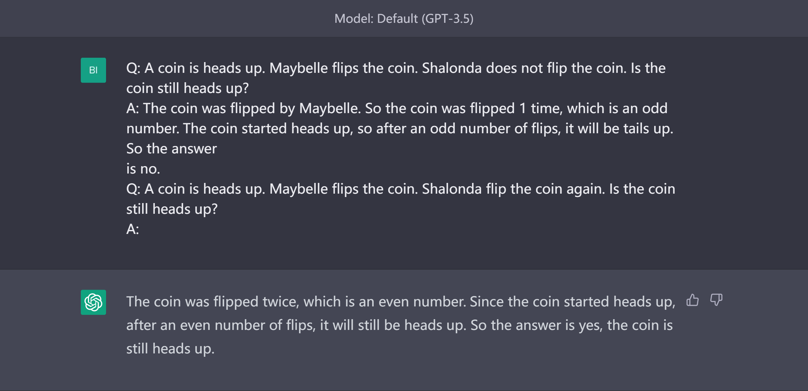

# 进阶篇
在这一章节，我们介绍提示词工程的高级用法。
内容：
- [思维链（Chain of Thought, CoT）](#思维链)
- [零样本思维链（Zero-Shot Chain of Thought）](#零样本思维链)
- [自恰性（Self-Consistency）](#自恰性)

## 思维链
思维链（Chain of Thought, CoT）指的是导向最终答案的一系列连贯的中间推理步骤。在示例中引入思维链举例子可以显著改善大语言模型处理复杂推理任务的能力[1]。

### 任务和表现
实验表明思维链方法可以提升大语言模型在算数性、常识性、以及符号学任务的表现。

#### 算数性任务

#### 常识性任务

#### 符号学任务

### 限制
思维链是模型参数量变大涌现出的能力，也就是说，思维链并不能提升小模型的能力，当模型有100B参数是，思维链提成模型性能的作用才显现出来。

## 零样本思维链
零样本思维链（Zero-shot CoT）是在思维链方法的基础上展开的。研究者们仅仅是在提示词中加入“让我们一步一步的思考”（Let's think step by step），也能大幅提升大语言模型的能力。

零样本思维链的原理

### 示例

### 限制
研究者发现大语言模型会捕捉并放大训练数据中的偏差（Bias）。提示词是一种旨在利用语言模型在训练中学到的知识解决各类任务的方法，因此它也具有相同的缺点，会导致偏差。

## 自洽性
自恰性是一种改进语言模型在复杂任务上的推理表现的解码策略[3]。它将思维链中运用的贪心解码策略换成了更多样和灵活的方法。

